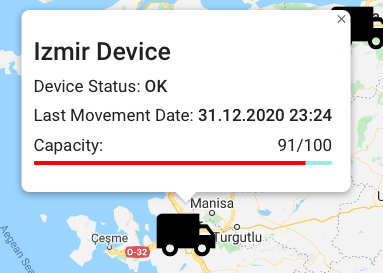

# Beevision Basic Control Center Task

In this task I decided to use MERN stack to solve the given task.

- MongoDB for the Database
- Express.js for the Back-End
- React.js for the Front-End
- Node.js for the Environment

In the README's I tried to keep content simple and explained file specific details in comments. 

Login and Registration part is **dynamic**, meaning that when a new user is created it'll be written down to a database and read from there.

But Map part is **static**, meaning that I hard coded the values and they are inside JavaScript files inside project folder.

---

To showcase the project I'll use Screenshots and explain it from there. 
I'll discuss my development choices in these two READMEs

- [Server README](./server/server.md)
- [Client README](./client/client.md)

---
## Installing the Project

To install the project you need to call:

`$ ~/beevision-task npm run beevision-install`

After calling these two you are ready to run the project.

## Starting the Project

To start our server and client simultaneously we call the following script in the **root** directory of our project.

For example `$~/beevision-task npm run beevision`

If everything executes successfully we will see;

1. `Server up and running on port 8000`
2. `Connected to Database!`
3. `Compiled Successfully`

## Landing Page

After starting the project a browser tab pops up at

`http://localhost:3000`

And we'll see our landing page

I wanted to name this project **Honeycomb** and use Orange color throughout the website.

## Register Page

Let's say we don't have an account and want to create one so we'll click the **Register** button 

After filling up the fields if everything is correct a new account will be created. If a field is not correct we will get the corresponding error message.

Let's check out our **Database** to see if we successfully created a new account.

Yes, we managed to create a new account successfully. You can see the name, the mail address and the password in the hashed format, and the creation date. 

## Login Page

Now we have created our account and lets login to our website

Just like register page if you don't fill the fields with the correct information you will get errors.

You also get a specific error regarding to field.

## Map Page

We are signed in to our account and we'll be greeted with a Turkey Map

This map is **static** meaning that we can't drag or zoom.

In the map there are 5 devices placed by me. When we click on these devices we'll get the information of that device just like:

In each device there are 4 fields

1. Name of the Device,
2. Status of the device either OK or an error,
3. Last movement date of the device,
4. Capacity of the device. (Max 100. If capacity is higher then 100 this will mean an error.)

Seems like there is an error in Istanbul Device and we can see its notification on the top left corner as:

Lets click Istanbul Device and see its status

As you see there is an error in the device.

Lastly on the top right corner we can see Logged user's name and a button to logout.

If we click Logout we will be redirected to our landing page.

### Thank you for reading

For more information about development please check out:

- [Server README](./server/server.md) for server
- [Client README](./client/client.md) for client

###### Written by **Kaan Kahraman**

